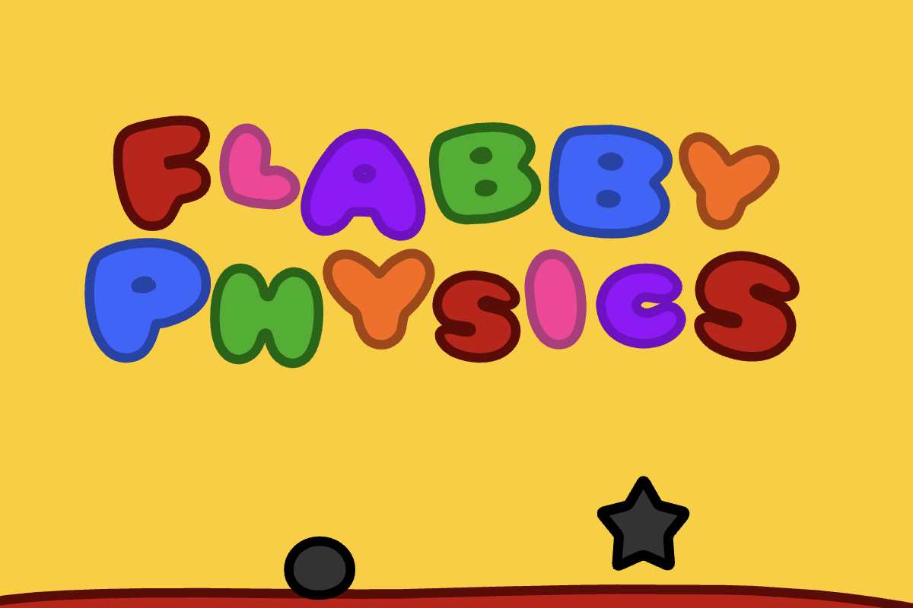

# 🎮 PolkaArena - Decentralized Arcade Gaming Marketplace



> **The Web3 version of Roblox** - A permissionless platform where anyone can upload, play, and monetize games on the blockchain.

[](https://polkadot.network/)
[](https://moonbeam.network/)
[](https://true.network/)

---

## 🌟 What is PolkaArena?

PolkaArena is a **decentralized arcade gaming marketplace** built on the Polkadot ecosystem. It democratizes game distribution by allowing anyone to upload games to the blockchain without permission, approval, or centralized control.

### Key Highlights

- 🎯 **For Gamers**: Play hundreds of arcade games with provably fair leaderboards
- 🎨 **For Developers**: Upload games without gatekeepers, retain full ownership
- 💎 **For Collectors**: Own cross-game NFT assets and rare collectibles
- 🔗 **For Everyone**: True digital ownership and censorship resistance

---

## 🚀 Features

### ✅ Current Features (MVP)

| Feature | Description |
|---------|-------------|
| **Permissionless Uploads** | Anyone can upload games to the blockchain via smart contracts |
| **On-Chain Score Attestation** | Game scores verified and stored on-chain via True Network |
| **IPFS Storage** | Games stored on decentralized storage, ensuring permanence |
| **Player Reputation** | Build your gaming reputation on-chain with verifiable history |
| **MetaMask Integration** | Seamless wallet connection for game uploads and plays |
| **Categorized Library** | Browse games by category: Arcade, Racing, Action, Puzzle, etc. |

### 🔮 Coming Soon

- 🪙 **Platform Token** - Governance and utility token for rewards
- 🎁 **Cross-Game Assets** - NFTs that work across multiple games
- 🏆 **Tournament System** - Competitive gaming with prize pools
- 📱 **Mobile App** - Play on the go
- 🛠️ **Game Creation SDK** - Build games directly on the platform

---

## 📸 Screenshots

### Home Page - Game Library

*Browse hundreds of arcade games organized by category*

### Upload Page - Blockchain Integration

*Upload games directly to the blockchain via smart contracts*

### Game Page - Play & Attest

*Play games and get your scores attested on-chain*

### Profile Page - Reputation System

*View your gaming stats and on-chain reputation*

---

## 🏗️ Technology Stack

### Blockchain
- **Moonbeam** - EVM-compatible Polkadot parachain for smart contracts
- **True Network** - On-chain attestations for game scores
- **Solidity** - Smart contract development

### Storage
- **IPFS** - Decentralized file storage
- **Pinata/Web3.Storage** - IPFS pinning services

### Frontend
- **Next.js 14** - React framework
- **TypeScript** - Type-safe development
- **TailwindCSS** - Styling
- **Ethers.js** - Blockchain interactions
- **Zustand** - State management

### Wallets
- **MetaMask** - EVM wallet integration
- **Polkadot.js** - Substrate wallet support

---

## 📜 Smart Contracts

### Moonbase Alpha Testnet

```
Network: Moonbase Alpha
Chain ID: 1287
RPC: https://rpc.api.moonbase.moonbeam.network

Smart Contract Address: `0x86E1d4bF5F232932Eb46ACb17B7D474c95A3068b`

Contract Functions:
- uploadGame(title, description, ipfsHash, thumbnailIpfs, category) → uint256
- getGame(gameId) → Game
- getAllGames(start, limit) → Game[]
- incrementPlayCount(gameId)
- gameCount() → uint256
```

### Contract Source

The smart contract source code is available at:
- **Solidity Contract**: [`contracts/evm_contract.sol`](contracts/evm_contract.sol)
- **ink! Contract (Alternative)**: [`contracts/lib.rs`](contracts/lib.rs)

---

## 🎯 Use Cases

### For Game Developers

- ✅ **Zero Barriers**: Upload games without approval or fees
- ✅ **Full Ownership**: Retain complete control of your creations
- ✅ **Direct Monetization**: No intermediaries taking revenue share
- ✅ **Global Reach**: Instant access to worldwide audience
- ✅ **Provable Portfolio**: Build reputation with on-chain proof

### For Gamers

- ✅ **Provably Fair**: Leaderboards you can trust
- ✅ **True Ownership**: Your achievements are permanently yours
- ✅ **Portable Reputation**: Gaming history follows you
- ✅ **Censorship Resistant**: Games can't be taken down
- ✅ **Free to Play**: No subscriptions or hidden fees

### For the Gaming Industry

- ✅ **Democratized Distribution**: No platform monopolies
- ✅ **Fair Economy**: Value flows to creators and players
- ✅ **Interoperability**: Cross-platform assets and achievements
- ✅ **Innovation**: Open ecosystem encourages experimentation

---

## 📖 How It Works

### 1. Game Upload Flow

```
Developer → Upload .swf to IPFS → Get IPFS hash →
Call uploadGame() on smart contract → Game stored on-chain
```

### 2. Game Play Flow

```
Player → Browse games → Select game →
Play game → Score attested via True Network →
Reputation updated on-chain
```

### 3. Cross-Game Assets (Coming Soon)

```
Player → Unlock NFT in Game A →
NFT stored in wallet → Use NFT in Game B
```

---

## 🌐 Why PolkaArena?

### The Problem with Traditional Gaming Platforms

| Traditional Platforms | PolkaArena |
|-----------------------|---------|
| ❌ 30-50% revenue cut | ✅ Zero platform fees |
| ❌ Arbitrary bans | ✅ Censorship-resistant |
| ❌ Closed ecosystem | ✅ Open & interoperable |
| ❌ Platform owns data | ✅ You own your data |
| ❌ Fake leaderboards | ✅ Provably fair scores |
| ❌ No asset portability | ✅ Cross-game assets |

### Democratizing Gaming

PolkaArena removes gatekeepers from gaming, similar to how:
- YouTube democratized video creation
- Spotify democratized music distribution
- Roblox democratized game creation

We're building a **fair, open, and transparent gaming economy** where creators and players are rewarded directly.

---

## 🗺️ Roadmap

### Phase 1: MVP (Current - Q1 2025) ✅
- [x] Smart contract development
- [x] Game upload functionality
- [x] IPFS integration
- [x] Basic game library
- [x] True Network score attestation
- [x] MetaMask wallet integration

### Phase 2: Growth (Q2 2025)
- [ ] Platform token launch (governance + utility)
- [ ] Developer revenue sharing model
- [ ] Enhanced reputation system
- [ ] Mobile-responsive improvements
- [ ] Game discovery algorithm

### Phase 3: Expansion (Q3 2025)
- [ ] Cross-game NFT assets
- [ ] Game developer DAO
- [ ] Tournament system with prizes
- [ ] Multiplayer infrastructure
- [ ] Community moderation tools

### Phase 4: Maturity (Q4 2025)
- [ ] Game creation SDK/Tools
- [ ] NFT asset marketplace
- [ ] Token staking & governance
- [ ] Mainnet migration
- [ ] Mobile native apps

---

## 🤝 Contributing

We welcome contributions from the community! Here's how you can help:

1. **Developers**: Contribute code, fix bugs, add features
2. **Designers**: Improve UI/UX, create assets
3. **Gamers**: Test games, report issues, provide feedback
4. **Game Creators**: Upload your games and help grow the library

See [CONTRIBUTING.md](CONTRIBUTING.md) for guidelines.

---

## 📄 Documentation

- [Setup Guide](SETUP.md) - Complete setup from scratch
- [Deployment Guide](contracts/MOONBEAM_DEPLOYMENT.md) - Deploy smart contracts
- [Integration Guide](INTEGRATION_GUIDE.md) - Integrate with the platform
- [Project Description](PROJECT_DESCRIPTION.txt) - Detailed project overview

---

## 🛡️ Security

Smart contracts have been developed with security best practices. However, this is currently a hackathon MVP and has not undergone formal audits. Use at your own risk.

For security concerns, please contact: [your-email@example.com]

---

## 📜 License

This project is licensed under the MIT License - see the [LICENSE](LICENSE) file for details.

---

## 🙏 Acknowledgments

- **Polkadot** - For the incredible blockchain infrastructure
- **Moonbeam** - For EVM compatibility on Polkadot
- **True Network** - For attestation infrastructure
- **IPFS** - For decentralized storage
- **The Community** - For support and feedback

---

## 📬 Contact & Community

- **Twitter**: [@prathamesh_io](https://x.com/prathamesh_io)
- **Website**: [Coming Soon]
- **Discord**: [Coming Soon]
- **Telegram**: [Coming Soon]

---

## ⭐ Show Your Support

If you like this project, please consider:
- ⭐ Starring this repository
- 🐦 Following on Twitter
- 🎮 Uploading your games
- 📢 Spreading the word

---

<div align="center">

**Built with ❤️ on Polkadot**

*Democratizing gaming, one block at a time*

[Get Started](SETUP.md) · [Upload a Game](/upload) · [Join Community](#)

</div>
